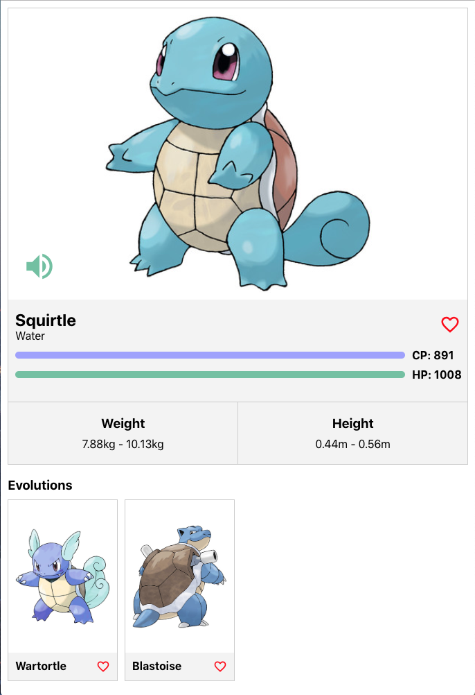

# Frontend coding exercise

This repository contains the instructions for the coding exercise for new developers joining the **front-end** development team for IBM Quantum.

## What we want you to build

Your mission is to build a small Pokedex application (to list and get information about Pokemon) that looks similar to the next (but remember, you have the freedom to express yourself!):

|             List View              |             Detail View              |
|:----------------------------------:|:------------------------------------:|
|  |  |

A video example can be found in the example folder at the root of the directory as `example.mov`

The features we expect that your app would contain would be:

- View all the Pokemon on a list and grid view. Take in count pagination (infinite scroll, simple pagination...)
- Search for Pokemon by text through the use of a search bar.
- Filter Pokemon by type using a dropdown.
- Add and remove a Pokemon to and from your Favorites by clicking the heart icon.
- Switch between `All` Pokemon and `Favorite` Pokemon views.
- View Pokemon details including their evolutions.

In your exercise, include a Readme file mentioning the technologies used and the reasons why. Also if there is something new that you have just learned for this exercise, please let us know too.

## What we provide

We have provided you with a simple **Rest/GraphQL API** server that serves Pokemon data and allows you to favorite/unfavorite them. You can find the endpoints and documentation in:

[Pokedex API](https://q-exercise-api.o64ixruq9hj.us-south.codeengine.appdomain.cloud/)

## Technology

- Typescript is the only required technology.
- You can use any framework you want: React, Vue, Svelte...
- You can use any meta-framework you want: Next, Nuxt, Remix, ... (*Please, don't waste your time configuring webpack manually*)
- You can use any component library you want
- You can use anything for styling: plain css, scss, css-in-js, ...

Use only what you are comfortable with and feel free to use any additional libraries you deem necessary to complete the exercise.

## How we will evaluate your exercise

We will evaluate your exercise in three main areas:

- **Features**: Does it fulfill all the required features? Do they work as intended? Does it manage loading and error states?
- **Look and feel, usability and responsiveness**: Here we will evaluate if the components and layout chosen makes sense for the features are easy to use, and works on a variety of device screens.
- **Code quality**: We will evaluate your code, if it's easy to follow, includes tests and it's well structured.

----

Feel free to ask us if you have any doubts or face any problems!
